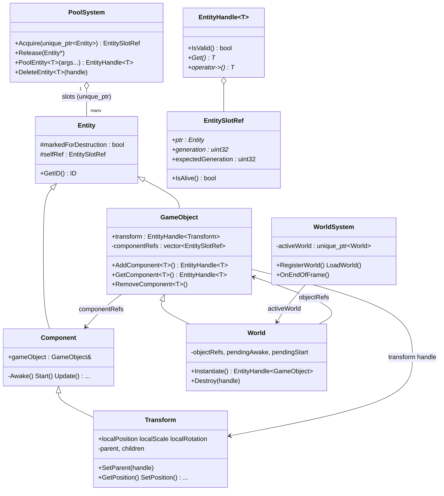
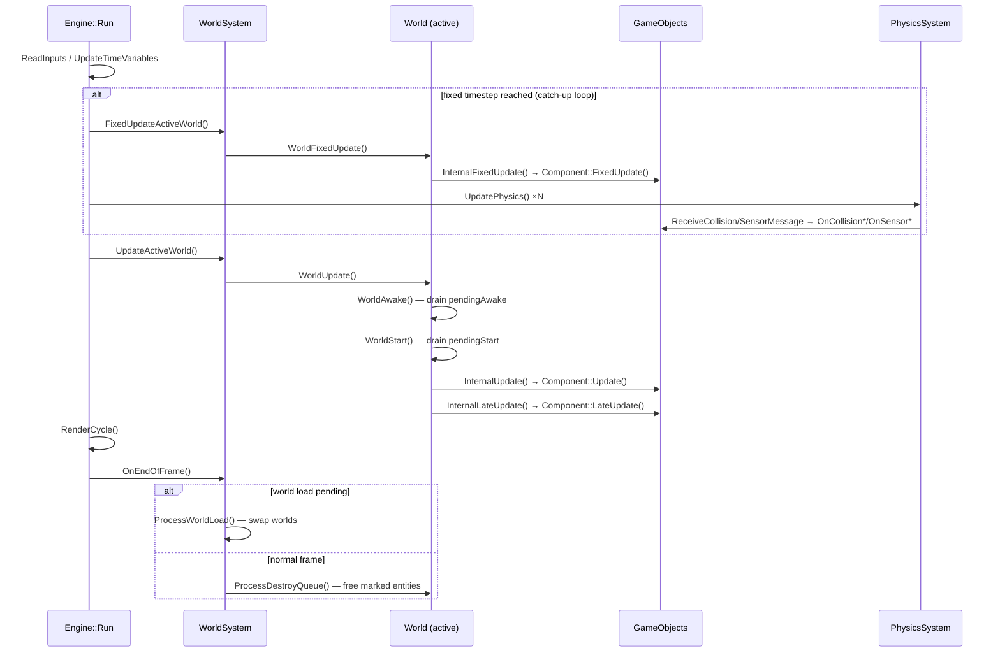
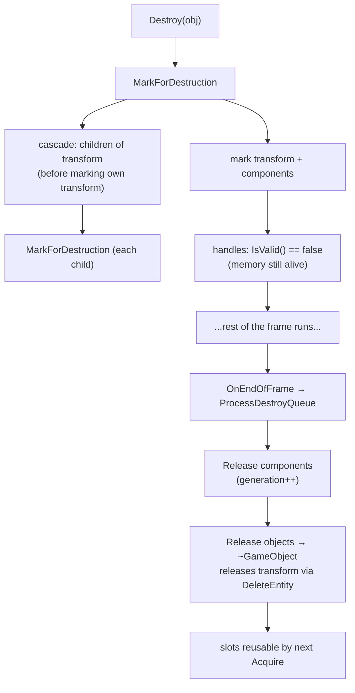

# DTEngine — Entity Lifecycle & Core Class Flow

This document explains, in detail, the lifecycle of an **Entity** in DTEngine — with focus on **GameObjects** and **Components** — and how the main classes involved interact, from creation to destruction. File paths refer to the repository layout (e.g. `Engine/src/core/World.cpp`).

---

## 1. Overview

DTEngine manages all dynamic gameplay objects through a **generational pool**:

- Every `GameObject`, `Component` and `Transform` is an `Entity` that lives inside the global `PoolSystem`, stored in a reusable **slot**.
- User code never owns entities directly. It holds **`EntityHandle<T>`** values — lightweight, copyable references that automatically become invalid when the entity is destroyed (no dangling pointers).
- The **`World`** owns the objects it instantiates; each `GameObject` owns its components and its `Transform`.
- Destruction is **deferred**: destroying an object only *marks* it (and everything it owns, and all of its hierarchy children). Handles invalidate immediately, but the memory/slot is only released at a safe point at the **end of the frame**.

The result is Unity-like ergonomics (`Instantiate` / `Destroy` / `AddComponent` / lifecycle hooks) with explicit, centralized ownership.



---

## 2. The cast of classes

### `Entity` — `Engine/include/DTEngine/Entity.hpp`, `Engine/src/core/Entity.cpp`

The root of everything poolable. It carries:

- **`id`** — a `uint32_t` unique per *living* entity. IDs are recycled: the destructor pushes the id into a static `freeIDs` list, and the constructor pops from it before minting a new one (`nextID++`).
- **`markedForDestruction`** — the deferred-destruction flag. It is what makes handles to a dying entity invalid *before* the slot is actually freed.
- **`selfRef`** — an `EntitySlotRef` pointing at the entity's own slot, filled in by `PoolSystem::Acquire`. It exists so a pooled entity can produce a handle to itself (`GameObject::GetHandle`, `Transform::GetHandle` — the latter is required by `Transform::SetParent` to register itself in the parent's children list). It stays **empty for entities that live outside the pool** — in practice, only the `World` (see §2, World).

### `EntitySlotRef` — `Engine/include/DTEngine/EntityHandle.hpp`

The type-erased, internal building block of the handle system:

```cpp
struct EntitySlotRef
{
    Entity* ptr;                  // raw pointer into the slot
    uint32_t* generation;         // pointer to the slot's generation counter
    uint32_t expectedGeneration;  // generation at the time the ref was created
    bool IsAlive() const;         // ptr != null && *generation == expectedGeneration
};
```

When a slot is released, the pool bumps its generation; every `EntitySlotRef` created before that instant stops matching and reports `IsAlive() == false`. This is the mechanism that makes stale references detectable without any bookkeeping on the referencing side. `EntitySlotRef` deliberately does **not** know about `markedForDestruction` — it answers "does this slot still hold the same entity?", nothing more. Engine internals (`GameObject::componentRefs`, `World::objectRefs`) store raw `EntitySlotRef`s precisely because they need to keep reaching marked entities to release them.

### `EntityHandle<T>` — `Engine/include/DTEngine/EntityHandle.hpp`

The public-facing safe reference. It wraps an `EntitySlotRef` and adds typed access plus destruction awareness:

- **`IsValid()`** — true only if the slot ref `IsAlive()` **and** the entity is *not* marked for destruction. So the moment `Destroy` marks an object, every handle to it (and to its components/transform/children) reads as invalid — a full frame before the memory goes away.
- **`Get()`** — returns `T*` when valid, `nullptr` otherwise. The safe way to "check and use".
- **`operator->()`** — convenience access that **asserts** on an invalid handle. Use it when validity is an invariant, `Get()` when it's a question.
- Comparisons with `nullptr`, `explicit operator bool()`, and construction from `nullptr` (`EntityHandle(std::nullptr_t)`) make handles read naturally: `if (child) ...`, `child->SetParent(nullptr)`.

Rule of thumb: **never cache the raw `T*` across frames** — cache the handle and call `Get()` when needed.

### `PoolSystem` — `Engine/src/system/PoolSystem.hpp/.cpp` (internal)

The single owner of every pooled entity. Entities live in `std::deque<EntitySlot>`, where each slot is `{ unique_ptr<Entity>, uint32_t generation }` (a deque so slots never relocate — `generation` pointers stay stable).

| Operation | What it does |
|---|---|
| `Acquire(unique_ptr<Entity>)` | Finds a free slot (or appends one), moves the entity in, builds an `EntitySlotRef` and stores it into the entity's `selfRef`. |
| `Release(Entity*)` | Finds the slot holding that pointer, destroys the entity (`unique_ptr::reset`) and **bumps the generation**, invalidating every outstanding ref/handle. Null-safe; no-ops during shutdown. |
| `PoolEntity<T>(args...)` | Typed convenience: constructs `T` in place and returns an `EntityHandle<T>`. The standard way to pool something. |
| `DeleteEntity(handle)` | Releases through the handle's *internal ref* (generation check only), deliberately bypassing the marked-for-destruction check — a marked entity still owns its slot and must be releasable. |

The `shuttingDown` flag guards teardown: clearing the pool runs entity destructors, which may re-enter `Release` (e.g. `~GameObject` releasing its components); those re-entrant calls become no-ops.

`PoolSystem` is an *internal* system (header under `Engine/src/system/`), reached via `SystemRegistry::GetSystem<PoolSystem>()`. Public headers never include it — `GameObject` bridges to it through non-template methods (`AddComponentImpl`, `FindComponentImpl`) implemented in the `.cpp`.

### `Component` — `Engine/include/DTEngine/Component.hpp`

The base class for behaviors. Holds a `GameObject& gameObject` back-reference (components cannot outlive or exist without an owner). All lifecycle hooks are **private virtuals** — only `GameObject` (a friend) invokes them:

- `Awake()` → `Start()` → then per frame: `FixedUpdate()`, `Update()`, `LateUpdate()`
- Physics messages: `OnCollisionEnter/Stay/Exit`, `OnSensorEnter/Stay/Exit`

Game code subclasses `Component` (e.g. `Game/SuperComponent.hpp`) and overrides what it needs.

### `GameObject` — `Engine/include/DTEngine/GameObject.hpp`, `Engine/src/core/GameObject.cpp`

The entity container. Owns:

- **`transform`** — a public `EntityHandle<Transform>`, created in the constructor via `PoolEntity<Transform>`. Every object always has one. It lives *outside* the component list: it takes no part in `GetComponent`/lifecycle calls and is released together with the object itself.
- **`componentRefs`** — `EntitySlotRef`s of the components added with `AddComponent<T>()`. `GetComponent<T>()` searches them by exact `typeid`; `RemoveComponent<T>()` just marks the component (freed at end of frame).
- `layer` (validated against `PhysicsSystem`), `tag`, `clickable`.

It also implements the destruction cascade (`MarkForDestruction`, §5) and fans lifecycle calls out to its components (`InternalAwake/Start/FixedUpdate/Update/LateUpdate`, `ReceiveCollisionMessage`, `ReceiveSensorMessage`).

### `Transform` — `Engine/include/DTEngine/Transform.hpp`, `Engine/src/core/Transform.cpp`

A `Component` (pooled like any other, but managed specially by its owner) responsible for **both** spatial data and the **scene hierarchy**:

- **Local fields** (`localPosition`, `localScale`, `localRotation`) are relative to the parent; they equal world space for root transforms.
- **World-space accessors** (`Get/SetPosition`, `Get/SetScale`, `Get/SetRotation`) compose up the parent chain (scale → rotate → translate). They are `virtual` so a future `RectTransform` (UI) can redefine the composition (anchors/pivot).
- **Hierarchy**: `SetParent(handle)` / `GetParent()` / `ChildCount()` / `ChildAt()` / `HasChild()`. Parent and children are stored as `EntityHandle<Transform>`. `SetParent`:
  1. rejects self-parenting and cycles (walks the ancestor chain first);
  2. captures the current world position/scale/rotation;
  3. swaps the parent (removing/adding itself in the child lists via `GetHandle()`);
  4. re-applies the captured world values so the object **does not move** when reparented. `SetParent(nullptr)` makes it a root, keeping its world transform.
- Invalidated child handles are pruned lazily (`PruneChildren` runs inside the child-accessors).

### `World` — `Engine/include/DTEngine/World.hpp`, `Engine/src/core/World.cpp`

A `GameObject` subclass that owns everything instantiated in it (`objectRefs`) and drives per-frame dispatch. Notable: the World itself is created with `std::make_unique<World>()` by `WorldSystem` — it is the **only Entity that lives outside the pool** (its `selfRef` stays empty; its *transform* is still pooled like any other, so parenting to it works).

### `WorldSystem` / `WorldManager` — `Engine/src/system/WorldSystem.cpp`, `Engine/src/core/WorldManager.cpp`

`WorldManager` is the public static facade (`RegisterWorld`, `LoadWorld`, `Instantiate`, `Destroy`); it forwards to the internal `WorldSystem`, which holds `activeWorld` and the list of registered worlds (`name` + start function). World loading is **deferred** (§6).

### `Engine` — `Engine/src/core/Engine.cpp`

Boots the `SystemRegistry` (which creates and `Init()`s all internal systems, `PoolSystem` included) and runs the main loop (§4).

---

## 3. Lifecycle: birth

### Instantiating a GameObject

```cpp
EntityHandle<GameObject> obj = WorldManager::Instantiate();
```

Flow (`World::Instantiate`, `Engine/src/core/World.cpp`):

1. `PoolSystem::Acquire(make_unique<GameObject>())` — the object is constructed and moved into a pool slot; its `selfRef` is filled.
2. **Inside the `GameObject` constructor**, before step 1 even returns: the default layer is set and the object's `Transform` is pooled via `PoolEntity<Transform>(*this)` and stored in the public `transform` handle.
3. The world records the slot ref in `objectRefs` (ownership) and queues it in **`pendingAwake`** and **`pendingStart`**.
4. The caller gets an `EntityHandle<GameObject>`.

The object is *live* immediately (you can add components, set its transform), but its `Awake`/`Start` hooks only run at the top of the **next** `WorldUpdate` (§4). Objects created mid-frame therefore never miss their hooks, and the copy-before-iterate in `WorldAwake`/`WorldStart` makes it safe to instantiate from inside `Awake`/`Start` themselves.

### Adding components

```cpp
EntityHandle<Rigidbody> rb = obj->AddComponent<Rigidbody>();
```

`AddComponent<T>` (header, `Engine/include/DTEngine/GameObject.hpp`) constructs `T(*this)` and hands it to the non-template bridge `AddComponentImpl`, which acquires a pool slot and appends the ref to `componentRefs`. There is **no deferred Awake for components** — a component added after the owner's `InternalAwake`/`InternalStart` already ran will only receive the per-frame hooks from then on (its `Awake`/`Start` run only if the owner's dispatch hasn't happened yet).

`GetComponent<T>()` does an exact-`typeid` scan of `componentRefs` and returns a handle (invalid handle if absent). The `Transform` is *not* discoverable this way — use the `transform` field.

---

## 4. Lifecycle: living — the frame

`Engine::Run` (`Engine/src/core/Engine.cpp`) drives everything:



Details worth knowing:

- **Fixed timestep**: `FixedUpdate` runs when the accumulated delta crosses the fixed step; physics then catches up N times. So `FixedUpdate` can run zero times or several times per rendered frame.
- **Order within a frame**: physics-related hooks (`FixedUpdate`, collision/sensor messages) happen *before* `Update`/`LateUpdate` of the same frame.
- **Dispatch guards**: every fan-out loop (world → objects → components) skips refs whose `IsAlive()` is false, so freed slots are never touched. Note that *marked* entities are still alive in this sense — a marked component keeps receiving `Update` until the end-of-frame cleanup. What changes immediately is how **handles** see it (§5).
- **Collision messages** (`Engine/src/system/PhysicsSystem.cpp`): after stepping physics, the system compares current vs. previous overlaps to classify ENTER/STAY/EXIT and calls `ReceiveCollisionMessage`/`ReceiveSensorMessage` on both objects, which route to the matching `OnCollision*`/`OnSensor*` hook of every component.

---

## 5. Lifecycle: death

Destruction is a **two-phase** protocol: *mark now, free at end of frame*.

### Phase 1 — marking (immediate)

```cpp
WorldManager::Destroy(obj);   // → World::Destroy → GameObject::MarkForDestruction
```

`GameObject::MarkForDestruction` (`Engine/src/core/GameObject.cpp`):

1. Sets its own `markedForDestruction` (re-entrance guard — also what breaks recursion).
2. **Cascades to hierarchy children first**: it reads `transform->children`, iterating over a **copy** (marking a child invalidates that child's handle inside the original vector), and calls `MarkForDestruction` on each child's owner object. This happens **before** marking its own transform/components, because marking the transform would invalidate the very `transform` handle being used to reach the children.
3. Marks its transform, then all of its components.

`RemoveComponent<T>()` is the small-scale version: it marks just that component.

**Effect on handles:** instantaneous. `EntityHandle::IsValid()` checks the mark, so from this moment every handle to the object, its components, its transform and its whole subtree returns `nullptr` from `Get()` — even though the memory is still there. The rest of the frame observes the object as already gone (e.g. `Transform::PruneChildren` drops it from child lists).

### Phase 2 — freeing (end of frame)

`WorldSystem::OnEndOfFrame` → `World::ProcessDestroyQueue` (`Engine/src/core/World.cpp`):

1. Every live object runs `ProcessComponentDestructionQueue`: marked components are `Release`d (slot freed, generation bumped) and their refs pruned from `componentRefs`. Components are freed **before** their owners.
2. Marked objects are `Release`d. `~GameObject` then releases whatever it still owns: remaining live components and its transform — the latter via `PoolSystem::DeleteEntity(transform)`, which works even though the handle is marked (it releases through the internal ref, generation-checked only).
3. Dead refs are pruned from `objectRefs`.

After the generation bump, *any* surviving `EntitySlotRef`/`EntityHandle` to those slots stops matching — the slot can be safely reused by the next `Acquire`.



Why deferred? Because destruction requests come from *inside* update code (a component destroying its own object, a collision callback destroying the other object). Freeing immediately would pull memory out from under the code currently executing. Marking keeps every pointer alive until the frame unwinds while making the death observable at once.

---

## 6. World swap & engine shutdown

### Loading a world

`WorldManager::LoadWorld(nameOrIndex)` does **not** load anything on the spot — it only records `pendingWorldIndex`/`worldLoadPending` in `WorldSystem`. The swap happens in `WorldSystem::OnEndOfFrame` → `ProcessWorldLoad`:

1. `activeWorld.reset()` — the old `World` is destroyed. `~World` releases every object it still owns; each `~GameObject` releases its components and transform. (On a swap frame the normal destroy queue is skipped — the whole world is going away anyway.)
2. A fresh `World` is constructed.
3. The registered **start function** for that world runs (this is where the game instantiates objects and wires components — see `Game/Game.cpp`).

The same deferral protects the common case of a component calling `LoadWorld` from its own `Update`: the world it lives in is destroyed only after the frame's updates have unwound. A load requested before the loop starts (e.g. from the game's constructor) is applied by the explicit `ProcessWorldLoad()` call at the top of `Engine::Run`.

### Shutdown

When the loop exits, `SystemRegistry::UnloadEverything()` tears the systems down. `~PoolSystem` sets `shuttingDown = true` and clears the pool; entity destructors that re-enter `Release` during this clear become no-ops instead of touching a container mid-destruction.

---

## 7. Handle semantics cheat-sheet

| Entity state | `EntitySlotRef::IsAlive()` | `EntityHandle::IsValid()` / `Get()` | Who can still free the slot |
|---|---|---|---|
| Live | ✅ | ✅ / `T*` | owner (mark → end of frame) |
| **Marked** (same frame as Destroy) | ✅ | ❌ / `nullptr` | engine internals via raw `EntitySlotRef`, or anyone holding the handle via `PoolSystem::DeleteEntity` (bypasses the mark) |
| Released (slot freed / generation bumped) | ❌ | ❌ / `nullptr` | nobody — slot is free for reuse |

Practical rules:

- **Hold handles, not pointers.** A `T*` from `Get()` is safe for the current scope; a handle is safe forever (it just goes invalid).
- Use `Get()` + null-check when absence is a normal case; use `operator->` when validity is an invariant (it asserts otherwise).
- A marked entity still *runs* (its `Update` fires until end of frame) but is *invisible* through handles. Don't confuse "slot alive" with "handle valid".
- Engine-internal ownership lists store `EntitySlotRef` precisely to keep reaching marked entities for cleanup; gameplay code should never need `EntitySlotRef` directly.
- `EntityHandle(std::nullptr_t)` + `SetParent(nullptr)`-style APIs: an empty/invalid handle is a meaningful value ("no parent", "no target"), not an error.
